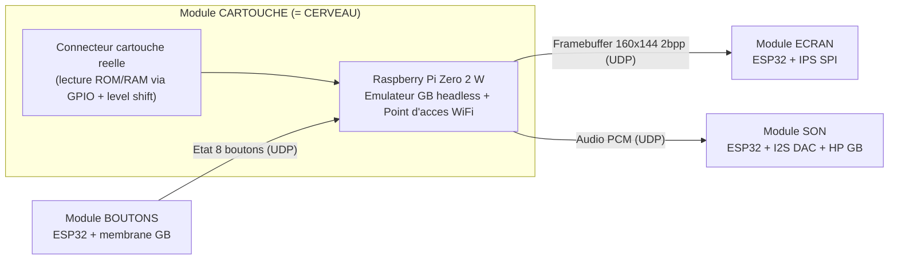

# Game Boy Pocket déstructurée — Spécifications techniques

*Projet artistique — 4 modules indépendants communiquant en WiFi.*
Version 1 — 23/07/2026

---

## 0. Décisions de départ

| Sujet | Choix retenu | Conséquence principale |
|---|---|---|
| Pièces | **Mix** : vraies pièces GB visibles (boutons, HP, connecteur, coques) + écran moderne | Authenticité côté toucher/son, écran simple à piloter |
| Objectif | **Réellement jouable** en main | Latence serrée : réseau dédié, UDP, buffers courts |
| Cerveau (émulateur) | **Dans le module cartouche** | Reste à 4 modules ; la ROM ne traverse jamais le WiFi |

---

## 1. Principe d'architecture (le point clé)

Une Game Boy n'est **pas** un ensemble de modules qui « communiquent ». C'est un système
synchrone unique autour d'un CPU (~4 MHz) et d'un bus mémoire : la cartouche est lue en
**nanosecondes**, l'écran piloté au cycle près, les boutons sont un registre mémoire.
Le WiFi, lui, a une latence de l'ordre de la **milliseconde** et variable — soit ~1000× trop lent.

> **Donc on ne distribue pas les puces internes sur le WiFi.**
> On fait tourner un **émulateur Game Boy** sur un cerveau central, et on distribue autour
> de lui les **périphériques d'entrée/sortie**. Le WiFi transporte alors des messages
> **haut niveau** (image écran, état des boutons, audio) dont les échelles de temps sont
> compatibles avec le réseau.

Comme le cerveau vit **dans le module cartouche**, la lecture de la cartouche réelle est une
opération **locale** (le Pi lit la ROM par ses propres broches). La ROM ne passe donc jamais
par le WiFi : le réseau ne porte que 3 flux (écran, boutons, son).

---

## 2. Vue d'ensemble



Schéma en clair :

```
                 [ CARTOUCHE réelle ]
                         | (bus local, 5V<->3.3V)
                         v
   +-----------------------------------------------+
   |  MODULE CARTOUCHE  =  CERVEAU                  |
   |  Raspberry Pi Zero 2 W                         |
   |  - émule la Game Boy                           |
   |  - lit la ROM/RAM de la cartouche localement   |
   |  - point d'accès WiFi dédié (SoftAP)           |
   +-----------------------------------------------+
        |  ^                                  |
 frame  |  | boutons                     audio|
 (UDP)  v  |  (UDP)                      (UDP) v
   [ ÉCRAN ]  [ BOUTONS ]                  [ SON ]
   ESP32      ESP32                        ESP32
   +IPS SPI   +membrane GB                 +DAC+HP GB
```

---

## 3. Le cerveau

**Rôle** : émuler la Game Boy, lire la cartouche physique, héberger le réseau WiFi, et
router les E/S vers/depuis les 3 autres modules.

**Matériel recommandé : Raspberry Pi Zero 2 W.**
Pourquoi le Pi plutôt qu'un ESP32-S3 : l'objectif « jouable » cumule sur le cerveau
l'émulation **plein régime**, la lecture cartouche, le rôle de point d'accès WiFi et
l'encodage/streaming écran+son. Le Pi (4 cœurs, Linux) absorbe ça sans stress. L'ESP32-S3
reste possible en version « puriste tout-ESP32 » mais au prix de compromis (30 fps, jeux
simples) et d'un logiciel plus tendu.

**Logiciel — le vrai travail de dev** : partir d'un cœur d'émulation GB léger et fidèle
(type Gambatte / SameBoy compilé *headless*), puis **remplacer ses backends d'E/S** :
- backend **vidéo** → au lieu d'afficher, encoder le framebuffer et l'envoyer en UDP à l'écran ;
- backend **entrée** → au lieu de lire un clavier, lire l'état reçu du module boutons ;
- backend **audio** → au lieu de jouer en local, streamer le PCM en UDP au module son ;
- backend **cartouche** → lire la ROM/RAM depuis le connecteur physique (GPIO).

C'est le point d'intégration central : ~4 « prises » à rediriger vers le réseau.

---

## 4. Spécifications par module

### 4.1 Module cartouche (contient le cerveau)

- **Rôle** : accueillir une **vraie cartouche GB**, lire sa ROM (et sa RAM de sauvegarde via
  le MBC), et héberger l'émulateur + le WiFi.
- **Pièce authentique** : connecteur de cartouche récupéré sur une console + coque/volet.
- **Interface cartouche** : 16 lignes d'adresse, 8 de données, contrôle (/RD, /WR, /CS, clk,
  reset). Le Pi n'a pas assez de GPIO « propres » pour tout : utiliser des **expanseurs**
  (74HC595 pour les adresses en sortie, 74HC165 pour les données en entrée, ou MCP23017 I²C).
- **⚠️ Niveau logique** : une cartouche GB fonctionne en **5 V**, le Pi en **3,3 V**.
  Prévoir des **level shifters** bidirectionnels sur le bus de données (ex. 74LVC245 avec
  contrôle de direction, ou TXB0108). À ne pas négliger.
- **MBC** : le lecteur doit gérer le banking pour lire les ROM > 32 Ko et lire/écrire la
  save RAM. Les schémas de dumpers GB open-source couvrent ce point.
- **Bonus fort (interactif)** : **hot-swap** — détecter l'insertion/retrait et recharger le
  jeu à chaud. Geste parfait pour une pièce d'art.
- **Alim** : LiPo + boost 5 V (le Pi Zero 2 W tire un courant non négligeable), ou power bank.

### 4.2 Module écran

- **Rôle** : recevoir le framebuffer par WiFi et l'afficher.
- **Écran** : **IPS/TFT moderne SPI** (ex. 2,0–2,4", ILI9341 240×320). On reçoit du 2 bits/px
  (4 niveaux), on mappe vers la palette voulue (gris « DMG », vert d'origine, etc.) et on
  met à l'échelle 160×144 → panneau.
- **MCU** : ESP32 (ou ESP32-S3 si upscaling/SPI rapide souhaité).
- **LCD d'origine** : réutiliser le vrai LCD GBP est **difficile** (il faut régénérer les
  signaux LCD que produisait le PPU). Gardé hors périmètre v1 ; écran moderne = plan sûr.
- **Alim** : LiPo + TP4056 + régulateur.

### 4.3 Module boutons

- **Rôle** : lire 8 contacts (D-pad Haut/Bas/Gauche/Droite + A/B/Start/Select) et envoyer
  les changements d'état.
- **Pièce authentique** : **membrane caoutchouc + PCB/contacts** récupérés sur une vraie GB.
- **MCU** : ESP32, 8 GPIO en entrée avec pull-ups, anti-rebond logiciel (~5 ms).
- **Chemin le plus sensible à la latence** : envoi immédiat à chaque changement + petit
  « heartbeat » périodique (~toutes les 15 ms) pour couvrir les pertes UDP.
- **Alim** : LiPo + TP4056.

### 4.4 Module son

- **Rôle** : restituer l'audio.
- **Pièce authentique** : **haut-parleur de GB** (et éventuellement molette de volume).
- **MCU + audio** : ESP32 + **DAC/ampli I²S** (ex. MAX98357A, DAC+ampli mono en un composant) → HP.
- **Approche v1 (simple)** : le cerveau envoie du **PCM** (ex. 32 kHz, 8 bits, mono
  ≈ 256 kbit/s) en UDP, joué avec un buffer court.
- **Approche « puriste » (v2)** : le cerveau n'envoie que les **écritures registres APU**, et
  le module **resynthétise localement** les 4 canaux GB (2 carrés, 1 wave, 1 bruit). Débit
  minuscule, latence potentiellement plus basse, et le module devient un vrai synthé — très
  raccord avec l'idée « déstructurée ». Coût : réimplémenter l'APU.
- **Alim** : LiPo + TP4056.

---

## 5. Réseau

### 5.1 Topologie
Le **cerveau (Pi) est le point d'accès WiFi** (SoftAP, `hostapd`) ; les 3 modules ESP32 s'y
connectent en clients. Réseau **autonome et dédié** (aucun autre trafic), **1 seul saut**
module↔cerveau → latence minimale.
*Repli si le mode AP du Pi est capricieux* : un petit **routeur de voyage dédié**, tous les
appareils en clients (2 sauts, mais très robuste).

### 5.2 Transport
**UDP**, jamais TCP : on veut de la **fraîcheur**, pas des retransmissions qui accumulent du
retard. On gère soi-même un numéro de séquence et on **jette les paquets en retard**.

### 5.3 Format des messages

| Message | Sens | Contenu | Cadence |
|---|---|---|---|
| `INPUT` | boutons → cerveau | seq (2o) + bitfield 8 boutons (1o) | à chaque changement + heartbeat ~15 ms |
| `FRAME` | cerveau → écran | seq + n° image + n° ligne + données 2 bpp (RLE possible) | 30–60 img/s, fragmenté en ~5 paquets/image |
| `AUDIO` | cerveau → son | seq + bloc PCM (~5–10 ms) *(ou événements APU en v2)* | flux continu |
| `HELLO`/`STAT` | module ↔ cerveau | présence, RTT mesuré | ~1 s |

Notes de débit :
- **Image** : 160×144×2 bits = **5 760 o/image**. À 60 img/s ≈ **2,76 Mbit/s** (brut) ;
  fortement compressible en RLE (grandes zones plates). MTU ~1 400 o ⇒ ~5 paquets/image.
- **Audio** PCM ≈ **0,25 Mbit/s**. **Boutons** : négligeable.
- Total ≈ **1–3 Mbit/s**, très en dessous de ce qu'encaisse un WiFi 2,4 GHz local dédié.

---

## 6. Budget de latence (jouabilité)

Cible : **< ~50–80 ms** du bouton à l'image, pour un ressenti « jouable » (comparable à un
bon écran LCD moderne en mode jeu).

| Étape | Latence typique |
|---|---|
| Détection bouton (poll + anti-rebond) | 1–5 ms |
| Bouton → cerveau (UDP, 1 saut) | 3–15 ms |
| Intégration à la frame émulée | ≤ 16,7 ms |
| Rendu + envoi image (UDP) | 5–10 ms |
| Réception + tracé SPI + panneau | 5–20 ms |
| **Total « photon »** | **~30–55 ms** ✔ jouable |

- **Audio** : garder un buffer **court** (~30–60 ms) pour éviter les coupures. C'est le point
  le plus « en retard » du système ; acceptable, et l'approche APU (v2) permet de le réduire.
- **Cadence** : démarrer à **30 img/s** (stable, marge réseau) puis pousser à **60** si la
  liaison tient.

---

## 7. Nomenclature (types de composants)

*Modèles indicatifs — à confirmer/sourcer au moment de l'achat.*

**Cartouche / cerveau**
- Raspberry Pi Zero 2 W + carte microSD
- Connecteur de cartouche GB (récupéré) + coque
- Level shifters 5 V↔3,3 V (74LVC245 / TXB0108) + expanseurs (74HC595, 74HC165 ou MCP23017)
- Alim : LiPo + module boost 5 V (ou power bank)

**Écran**
- ESP32 (ou ESP32-S3)
- Écran IPS/TFT SPI 2,0–2,4" (ex. ILI9341)
- LiPo + TP4056 + régulateur

**Boutons**
- ESP32
- Membrane + contacts boutons récupérés d'une vraie GB
- LiPo + TP4056

**Son**
- ESP32
- MAX98357A (DAC+ampli I²S) + haut-parleur GB récupéré
- LiPo + TP4056

**Réseau**
- Aucun (Pi en point d'accès) — ou petit routeur de voyage dédié en repli

---

## 8. Plan de prototypage incrémental

On commence **tout câblé**, puis on « coupe les fils » un par un pour isoler chaque risque :

1. **Émulateur + E/S locales** sur le Pi (écran, boutons, son branchés directement) →
   valider qu'un jeu tourne et se joue.
2. **Déporter les boutons** en WiFi/UDP → **mesurer** la latence réelle en jeu.
3. **Déporter l'écran** en UDP → régler débit / fragmentation / cadence (30→60 img/s).
4. **Déporter le son** (PCM d'abord) → régler la taille de buffer.
5. **Lecture cartouche réelle** sur le Pi (dump ROM + save) puis **hot-swap**.
6. **Fignolage** : son en resynthèse APU (v2), habillage des 4 modules, alimentations.

Chaque étape est démontrable seule — pratique pour une pièce en cours de construction.

---

## 9. Risques & parades

| Risque | Parade |
|---|---|
| Niveau 5 V cartouche vs 3,3 V Pi | Level shifters bidirectionnels sur le bus |
| Mode point d'accès du Pi instable | Repli sur petit routeur de voyage dédié |
| Latence audio perceptible | Buffer court ; passer à la resynthèse APU (v2) |
| Cadence 60 img/s difficile | Démarrer à 30 img/s + compression RLE |
| Congestion / pertes WiFi | Réseau dédié, canal fixe peu encombré, UDP + drop des retards |
| Charge du cerveau | Pi Zero 2 W (marge) plutôt qu'ESP32-S3 |

---

## 10. Extensions possibles

- **Détection de hot-swap** avec animation de changement de jeu.
- **Module son = synthé APU** exposé (LED par canal, etc.).
- **5e module « cerveau » visible** si tu veux au contraire *montrer* le calcul plutôt que le
  cacher dans la cartouche.
- **LCD d'origine** piloté pour l'authenticité maximale (chantier avancé).

---

*Question ouverte pour affiner : autonomie visée (installation sur secteur vs portable sur
batterie) — ça change le dimensionnement des alims et le choix Pi vs ESP32-S3.*
